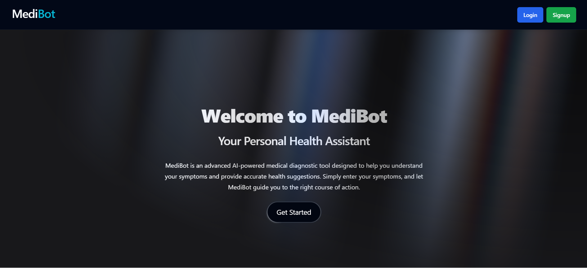
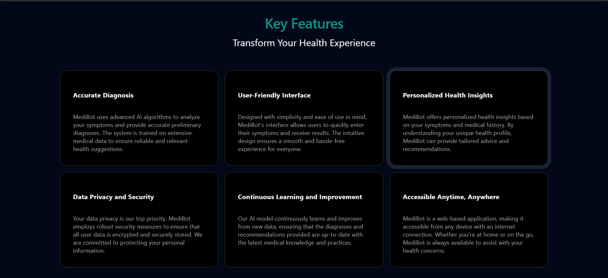
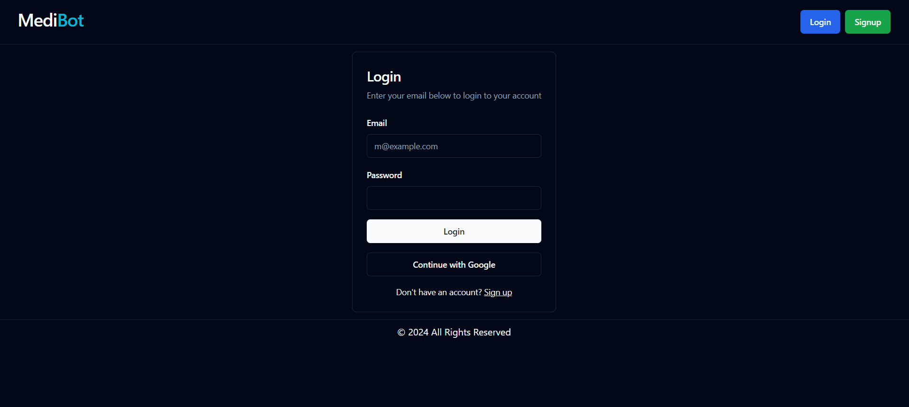
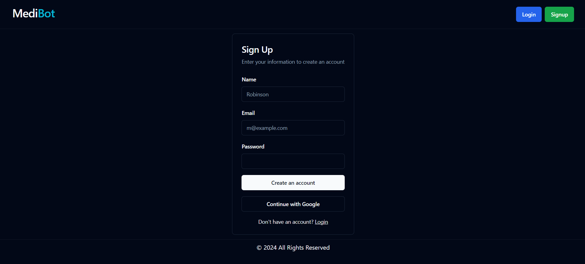
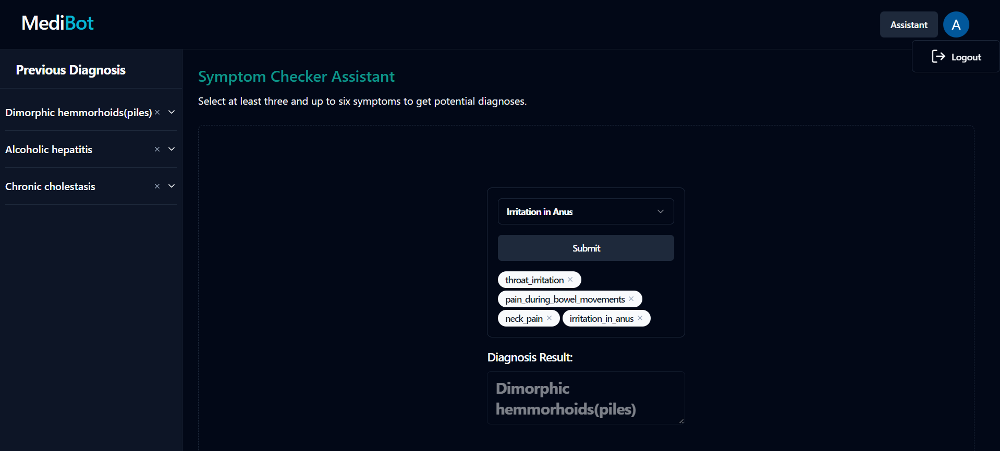

# Medibot

Medibot is a web application for diagnosing health conditions based on user-provided symptoms. It features a responsive user interface, authentication via Gmail and Google OAuth, and a diagnosis assistant powered by a machine learning model.


## Cloning
To clone this repository to your local machine, open a new folder and run the following command in terminal:

```bash
git clone https://github.com/avinashkt04/MediBot.git
```
    

## Installation

### Server

1. Navigate to the `server` directory:
    ```bash
    cd .\server
    ```
2. Install dependencies:
    ```bash
    npm i
    ```
3. Configure environment variables:
Create a `.env` file in the `server` directory with the following content:
    ```dotenv
    PORT=8000
    MONGODB_URI=<your_mongodb_uri>
    ACCESS_TOKEN_SECRET=<your_access_token_secret>
    ACCESS_TOKEN_EXPIRY=10d
    CORS_ORIGIN=http://localhost:5173
    CLIENT_ID=<your_google_client_id>
    CLIENT_SECRET=<your_google_client_secret>
    SESSION_SECRET=<your_session_secret>
    ```
    Replace <your_mongodb_uri>, <your_access_token_secret>, <your_google_client_id>, <your_google_client_secret>, and <your_session_secret> with your actual values.
    \


    **Note:** If you don't have `CLIENT_ID` and `CLIENT_SECRET`, set dummy value given below:

    ```console
    CLIENT_ID=dummy-client-id-1234567890abcdef
    CLIENT_SECRET=dummy-client-secret-abcdefghijklmnopqrstuvwxyz0123456789
    ```

4. Start the server:
    ```console
    npm run start
    ```
    The server will start on ```http://localhost:8000.```


### Client

#### Open new terminal

1. Navigate to the client directory:
    ```bash
    cd .\client
    ```
2. Install dependencies:
    ```bash
    npm install
    ```
3. Start the development server:
    ```bash
    npm run dev
    ```
    The client development server will start on ```http://localhost:5173.```


### Model

#### Open new terminal

1. Navigate to the model directory:
    ```bash
    cd .\model
    ```

2. Run the Python script:
    ```bash
    python trial.py
    ```

## Configuration

### Google OAuth Setup

To enable Google OAuth authentication, follow these steps:

**Google Developer Console Setup:**

1. Go to [Google Developer Console](https://console.developers.google.com/).
2. Create a new project or select an existing one.
3. Navigate to **Credentials** under **APIs & Services**.
4. Click on **Create credentials** and choose **OAuth client ID**.
5. Select **Web application** as the application type.

**Configure OAuth Client:**

- Set **Authorized JavaScript origins** to:
  - http://localhost:5173
  - http://localhost

- Set **Authorized redirect URIs** to:
  - http://localhost:8000/api/v1/google/callback

Make sure to replace `http://localhost:8000` with your actual server URL if it's different.

**Note:** If you choose not to configure Google Developer Console for OAuth, the application will still function. Users can't use the "Continue with Google" feature, but they can authenticate using email.

## Screenshots

### Home Page





### Login Page



### Signup Page



### Assistant Page



